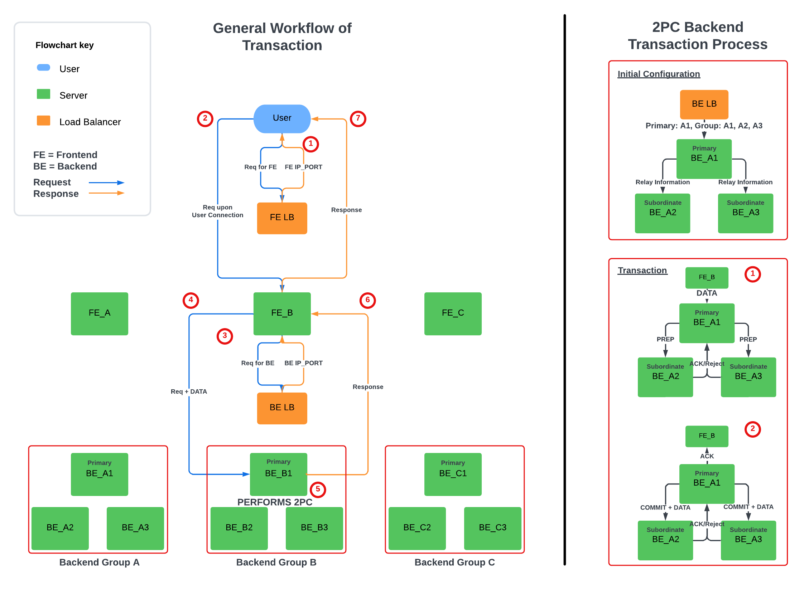

# Welcome to PennCloud :cloud:
- Adam Gorka @AdamEGorka, Andrew Lukashchuk @lukashchu, Hassan Rizwan @hrizwan3, Jiwoong (Matt) Park @mtp0326
- 11/08/2024 -

## Introduction
PennCloud is a storage and communication platform that allows users to store files, send emails, and chat with others. It is designed to be user-friendly and efficient, with distributed servers and fault tolerance to ensure the platform is always available. The platform is built with a frontend load balancer, frontend servers, backend servers, and an SMTP server to handle the various functionalities.

## Deployed Link
Coming Soon!

## Frontend Features

### Storage Drive

In chronological order:
- Add folders to the root directory
- Add files to a specified folder
- Move a file to a different path
- Rename a file
- Download a file

### Send Email to Another PennCloud User
.gif)
- We see two separate tabs, where one in the yellow tab is the sender, and the other in the black tab is the receiver. The email is sent and received through SMTP protocol.

### Send Email to an External Email Address
.gif)
- The emails can also be sent to external email addresses such as Gmail.

### Chat

- We again see two separate tags: the yellow tab is Adam, and the black tab is Admin. The chat is sent and received in real-time and ordered chronologically.

## Flowchart of the Architecture
Our design overall consists of various components. There is a frontend load balancer the user connects to, which then redirects the user to one of the available frontend servers. The frontend servers then interact with the backend coordinator, which gives them an appropriate backend storage server to connect to and handle the request. Additionally, an extra frontend server acts as the SMTP server to support retrieving mail from external sources and then directing that mail to the backend by first going to the backend coordinator, as with the other frontend servers.

### General Workflow of Transaction:
1. When the user sends a transaction request from the webpage, the request is sent to the frontend load balancer. The frontend load balancer then provides the user with the IP address and port of the frontend server.
2. The user then sends a connection and transaction request to the indicated frontend server.
3. The frontend server then sends a transaction request to the backend load balancer to get an available backend group's IP address and port. The load balancer then provides the IP address and port of the primary node for the available backend group.
4. The frontend server then sends the transaction request to the primary node of the backend group.
5. The backend group performs a 2PC protocol to process the request (will be specified in the 2PC Backend Transaction Process).
6. The primary node will return the result to the frontend server.
7. The frontend server will then return the result to the user.

### 2PC Backend Transaction Process
**Initial Configuration:** The backend load balancer will first assign the primary and subordinate nodes to the primary backend node for each group, to which the primary backend node will then send the configuration to the subordinate nodes.

**Transaction:**
1. The frontend server will first send the transaction request to the primary node of the backend group. If the transaction is a GET request, the primary node immediately returns the result to the frontend server. If the transaction is a PUT, PUTV, or DELETE request, the primary node will perform a 2PC protocol with the other subordinate nodes in the backend group. For the 2PC protocol, the primary node will first send a PREP message to the subordinate nodes, to which the nodes respond with an ACK or REJECT message.
2. If all the subordinate nodes respond with ACK, the primary node will perform the transaction and then send a COMMIT message to the subordinate nodes for them to perform their transactions. If any subordinate node responds with REJECT, the primary node will send an ABORT message to the subordinate nodes.

## Backend Features

### 2PC Protocol and Fault Tolerance
The logs represent the three nodes in the same backend group. The leftmost log is the primary node, and the other two are the subordinate nodes.

#### Fully functioning group (3 Nodes):

- The login shows that the transaction with the 2PC protocol is working well. We see the primary node sending the PREP message to the subordinate nodes and the subordinate nodes responding with ACK. The primary node then sends a COMMIT message to the subordinate nodes before doing its transaction, and the subordinate nodes perform their transactions.

#### 1 Faulty Node (2 Nodes):

- We shut down the primary node, which will be caught by the heartbeat system from the backend coordinator that regularly checks for the health of each backend node. The two subordinate nodes are then assigned a new primary node, as seen in "New configuration." We can see that changing the user's password still works well with 2 nodes and their interaction.

#### 2 Faulty Nodes (1 Node):

- We shut down the primary node from the 2 nodes once again. We see that the node with the log to the right is the new primary node and can easily perform the chat transaction.

### Key-value store
The backend consists of a backend coordinator and multiple backend servers which handle the commands PUT, GET, CPUT, DELETE, as well as some other commands that are helpers for other services, such as the admin console. The backend storage service is truly distributed where there is extensive fault tolerance. If one storage node is stopped, the coordinator will notice and direct the users to a working storage node. Additionally, the data is replicated across the storage nodes, so the users will not lose data in case the storage node they were previously accessing fails. The storage servers are grouped by 3, where each group has a primary node. For each transaction, the primary storage server will send a prepare to the other storage servers in its group, which will respond and if all other storage servers response ready the transaction will go through as 2PC is implemented within the system.

### Tablet/Partitioning
For the tablets and partitioning we used a predetermined size (by default 50 MB) to determine whether a given tablet should be split into two. Each KV store server contains a vector of currently active tablets and places incoming requests into the tablets based on their key range (which dynamically changes as more write operations are performed). Each tablet maintains a log of the write operations it has received in one of the following formats: PUTV;row;col;valueSize;value or CPUT;row;col;v1Size;v2Size;v1;v2 or DELE;row;col. This allows operations to be replayed at recovery.

### Checkpointing
Every tablet logs each incoming transaction. These logs are replayed upon revival of a node. Additionally, each tablet periodically checkpoints (by default, every 10 write transactions). Once a node is restarted, it requests the latest checkpoint numbers from the primary. If the numbers on its local folder match, we replay the latest local checkpoints. If they do not, the node requests the latest checkpoint file(s) from the primary and then replays them. If the primary receives any new transactions during this time, they are also forwarded to the recovering node. We were, however, unable to get the checkpoint replaying functionality to replay the checkpoint upon revival.

### Heartbeat
The coordinator would run a heartbeat system by pinging a port open on each storage node in a separate thread specifically open for pinging heartbeats. Each time it is pinged, it receives the pid of the storage server as well as knowing that it is running. The pings would be sent out every 100ms, and if no response is received for 5 pings, the server would be marked as down and no longer used by the coordinator until it is active again. The pid received is used for debugging via the admin console which can stop and start any of the storage servers.
